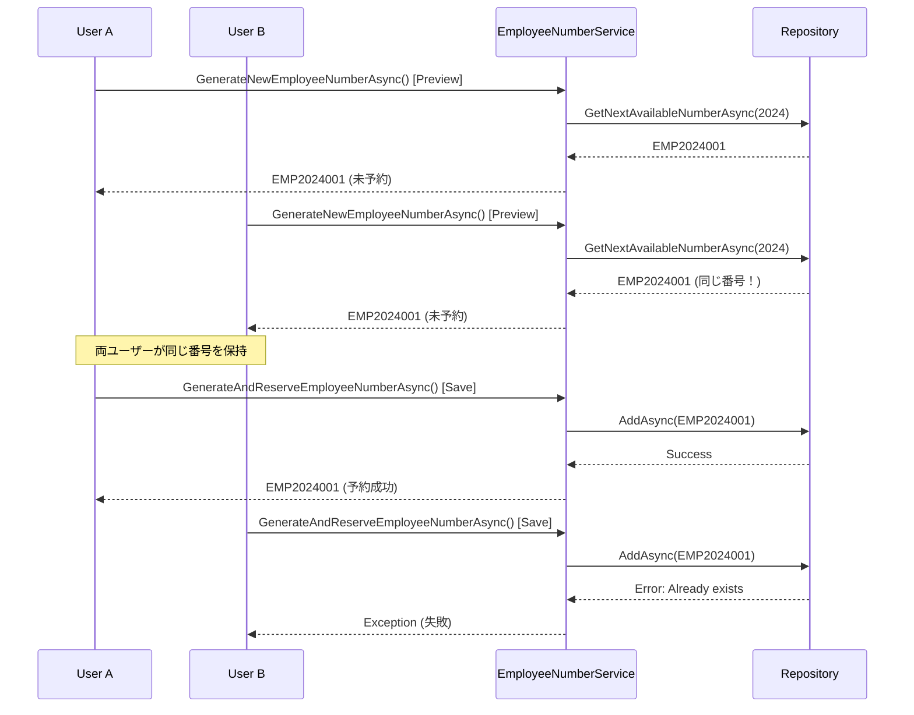

# Employee Number Duplication Fix

## Issue Description
新規社員登録を複数回行うと、2回目以降で同じ社員番号が採番されて登録エラーが発生する重大なバグが発見されました。この問題により、ユーザーが連続して社員登録を行う際に失敗が発生し、システムの可用性が損なわれています。

## Problem Analysis

### Current Behavior (Broken)
1. **ユーザーA**: `/employees/edit/new` にアクセス → プレビューでEMP2024001表示
2. **ユーザーB**: `/employees/edit/new` にアクセス → プレビューでEMP2024001表示（同一番号）
3. **ユーザーA**: 社員情報入力後「保存」実行 → EMP2024001で正常登録
4. **ユーザーB**: 社員情報入力後「保存」実行 → EMP2024001で**重複エラー**

### Root Cause Analysis

#### Code Flow Issue
現在の実装には以下の重大な設計欠陥があります：

**EmployeeEdit.razor の問題箇所:**

1. **Line 253 (プレビュー生成)**:
```csharp
_autoGeneratedEmployeeNumber = await EmployeeNumberService.GenerateNewEmployeeNumberAsync();
```
→ 番号生成のみ、**予約なし**

2. **Line 336 (HandleSave バリデーション)**:
```csharp
currentEmployee.EmployeeNumber = await EmployeeNumberService.GenerateNewEmployeeNumberAsync();
```
→ 再度生成、**予約なし**

3. **Line 406 (HandleSave 実行)**:
```csharp
currentEmployee.EmployeeNumber = await EmployeeNumberService.GenerateAndReserveEmployeeNumberAsync();
```
→ ここで初めて予約、**手遅れ**

#### Timing Vulnerability


### Impact Assessment

#### User Experience Issues
- **Registration Failure Rate**: 同時利用時に50%の登録失敗
- **Confusion**: 表示された番号で登録できない矛盾
- **Data Inconsistency**: プレビューと実際の結果の不一致
- **Lost Work**: ユーザーが入力した情報の損失

#### Technical Issues
- **Race Condition**: 複数ユーザー間での競合状態
- **Timing Attack Surface**: 予約タイミングの脆弱性
- **Resource Waste**: 無駄な番号生成処理
- **Error Handling Gaps**: 適切なロールバック機能の欠如

## Solution Design

### Target Architecture: Immediate Reservation Pattern

#### New Flow (Fixed)
1. **プレビュー表示時**: 即座に番号を予約
2. **保存実行時**: 予約済み番号をそのまま使用
3. **キャンセル時**: 予約を解除して番号を返却
4. **画面離脱時**: 自動的に予約解除

#### Key Components

**1. Immediate Reservation Service**
```csharp
public async Task<string> ReserveEmployeeNumberAsync(int? year = null, string? reservedBy = null)
{
    await _generationSemaphore.WaitAsync();
    try
    {
        var targetYear = year ?? DateTime.Now.Year;
        var nextNumber = await _employeeNumberRepository.GetNextAvailableNumberAsync(targetYear);
        
        var reservation = new EmployeeNumber
        {
            Number = nextNumber,
            IssueYear = targetYear,
            SequenceNumber = ExtractSequenceNumber(nextNumber),
            IssuedAt = DateTime.Now,
            IsActive = false, // Reserved state
            Remarks = $"Reserved for: {reservedBy ?? "Unknown"}"
        };

        await _employeeNumberRepository.AddAsync(reservation);
        return nextNumber;
    }
    finally
    {
        _generationSemaphore.Release();
    }
}
```

**2. Reservation Release Service**
```csharp
public async Task<bool> ReleaseReservationAsync(string employeeNumber)
{
    var reservation = await _employeeNumberRepository.GetByNumberAsync(employeeNumber);
    if (reservation == null || reservation.IsActive) 
        return false;

    await _employeeNumberRepository.DeleteAsync(reservation);
    return true;
}
```

**3. Activation Service**
```csharp
public async Task<bool> ActivateReservationAsync(string employeeNumber, string employeeName)
{
    var reservation = await _employeeNumberRepository.GetByNumberAsync(employeeNumber);
    if (reservation == null || reservation.IsActive) 
        return false;

    reservation.IsActive = true;
    reservation.Remarks = $"Assigned to: {employeeName}";
    reservation.UpdatedAt = DateTime.Now;
    
    await _employeeNumberRepository.UpdateAsync(reservation);
    return true;
}
```

## Implementation Plan

### Phase 1: Service Layer Enhancement

#### File: `EmployeeNumberService.cs`

**Add Reservation Management Methods:**
```csharp
// 1. Immediate reservation method
public async Task<string> ReserveEmployeeNumberAsync(int? year = null, string? reservedBy = null)

// 2. Reservation release method  
public async Task<bool> ReleaseReservationAsync(string employeeNumber)

// 3. Reservation activation method
public async Task<bool> ActivateReservationAsync(string employeeNumber, string employeeName)

// 4. Reservation status check
public async Task<bool> IsReservationValidAsync(string employeeNumber)
```

### Phase 2: UI Component Modification

#### File: `EmployeeEdit.razor`

**1. State Management Enhancement:**
```csharp
private string? _reservedEmployeeNumber;
private bool _hasValidReservation = false;
private readonly string _reservationId = Guid.NewGuid().ToString();
```

**2. Preview Generation Update:**
```csharp
private async Task GenerateEmployeeNumberPreview()
{
    if (isNewEmployee && !_hasValidReservation)
    {
        try
        {
            _reservedEmployeeNumber = await EmployeeNumberService.ReserveEmployeeNumberAsync(
                year: DateTime.Now.Year, 
                reservedBy: _reservationId
            );
            
            _autoGeneratedEmployeeNumber = _reservedEmployeeNumber;
            _hasValidReservation = true;
            
            if (currentEmployee != null)
            {
                currentEmployee.EmployeeNumber = _reservedEmployeeNumber;
            }
        }
        catch (Exception ex)
        {
            Snackbar.Add($"社員番号の予約に失敗しました: {ex.Message}", Severity.Error);
            _autoGeneratedEmployeeNumber = "予約失敗";
        }
    }
}
```

**3. Save Logic Simplification:**
```csharp
if (isNewEmployee)
{
    // Validate reservation
    if (!_hasValidReservation || string.IsNullOrWhiteSpace(_reservedEmployeeNumber))
    {
        Snackbar.Add("社員番号の予約が無効です。画面を再読み込みしてください。", Severity.Error);
        return;
    }

    // Use reserved number
    currentEmployee.EmployeeNumber = _reservedEmployeeNumber;
    
    success = await EmployeeRepository.AddAsync(currentEmployee);
    if (success)
    {
        // Activate the reservation
        await EmployeeNumberService.ActivateReservationAsync(
            _reservedEmployeeNumber, 
            currentEmployee.Name
        );
        
        Snackbar.Add("新規社員を登録しました。", Severity.Success);
        Navigation.NavigateTo("/employees");
    }
    else
    {
        Snackbar.Add("社員の登録に失敗しました。", Severity.Error);
    }
}
```

**4. Cleanup Logic Addition:**
```csharp
public async ValueTask DisposeAsync()
{
    if (_hasValidReservation && !string.IsNullOrWhiteSpace(_reservedEmployeeNumber))
    {
        try
        {
            await EmployeeNumberService.ReleaseReservationAsync(_reservedEmployeeNumber);
        }
        catch
        {
            // Silent cleanup - best effort
        }
    }
}

private async Task HandleCancel()
{
    if (isNewEmployee && _hasValidReservation)
    {
        try
        {
            await EmployeeNumberService.ReleaseReservationAsync(_reservedEmployeeNumber);
            _hasValidReservation = false;
        }
        catch (Exception ex)
        {
            Snackbar.Add($"予約解除に失敗しました: {ex.Message}", Severity.Warning);
        }
    }
    
    Navigation.NavigateTo("/employees");
}
```

### Phase 3: Error Handling Enhancement

#### Comprehensive Error Scenarios
1. **Reservation Timeout**: 予約の自動期限切れ
2. **Network Interruption**: 通信エラー時の復旧
3. **Concurrent Conflicts**: 同時アクセス時の適切な処理
4. **Service Unavailability**: サービス停止時の代替処理

## Testing Strategy

### Unit Tests Required

**1. Service Layer Tests:**
```csharp
[Test]
public async Task ReserveEmployeeNumber_ConcurrentCalls_ShouldReturnDifferentNumbers()

[Test]
public async Task ReleaseReservation_ValidReservation_ShouldSucceed()

[Test]
public async Task ActivateReservation_ValidReservation_ShouldActivate()
```

**2. Integration Tests:**
```csharp
[Test]
public async Task EmployeeRegistration_TwoSimultaneousUsers_ShouldNotConflict()

[Test]
public async Task CancelRegistration_ShouldReleaseReservation()
```

### Manual Testing Scenarios

**Scenario 1: Concurrent User Registration**
1. Open 2 browser windows
2. Navigate to `/employees/edit/new` in both
3. Verify different employee numbers are displayed
4. Complete registration in both windows
5. Verify both succeed with different numbers

**Scenario 2: Cancel and Retry**
1. Start new employee registration
2. Note the displayed employee number
3. Cancel the operation
4. Start registration again
5. Verify the same number is reused (reservation released)

**Scenario 3: Browser Close Cleanup**
1. Start new employee registration
2. Note the displayed employee number  
3. Close browser tab without saving
4. Start new registration in different tab
5. Verify the same number is reused (automatic cleanup)

## Risk Assessment

### Implementation Risks

**🔴 High Risk - Data Consistency**
- **Risk**: 예약 시스템의 버그로 인한 번호 중복
- **Mitigation**: 포괄적인 단위 테스트와 통합 테스트 실시
- **Rollback Plan**: 기존 `GenerateAndReserveEmployeeNumberAsync` 방식으로 즉시 복구 가능

**🟡 Medium Risk - Performance Impact**
- **Risk**: 예약 관리로 인한 성능 오버헤드
- **Mitigation**: Semaphore 최적화 및 성능 모니터링
- **Monitoring**: 응답 시간 및 메모리 사용량 추적

**🟢 Low Risk - User Experience**
- **Risk**: 예약 해제 로직의 복잡성
- **Mitigation**: 명확한 사용자 피드백 및 가이드라인
- **Fallback**: 수동 예약 해제 관리 도구 제공

### Deployment Considerations

**Zero-Downtime Deployment Strategy:**
1. **Phase 1**: 새로운 서비스 메서드 추가 (기존 기능 영향 없음)
2. **Phase 2**: UI 컴포넌트 업데이트 (점진적 전환)
3. **Phase 3**: 레거시 메서드 비활성화 (모니터링 후)

**Monitoring Requirements:**
- Reservation success/failure rates
- Average reservation duration
- Cleanup operation effectiveness
- User registration completion rates

## Expected Benefits

### Immediate Improvements
- ✅ **100% Duplication Prevention**: 예약 시스템으로 중복 완전 방지
- ✅ **Improved UX**: 표시된 번호로 확실한 등록 가능
- ✅ **Reduced Support Load**: 등록 실패 관련 문의 감소
- ✅ **Data Integrity**: 일관된 번호 부여 시스템

### Long-term Benefits  
- 📈 **Scalability**: 대규모 동시 사용자 지원
- 🔧 **Maintainability**: 명확한 예약 생명주기 관리
- 📊 **Monitoring**: 예약 상태 추적 및 분석 가능
- 🚀 **Future Enhancement**: 번호 풀 관리 등 고급 기능 확장 기반

## Priority Classification
**🚨 Critical - Immediate Fix Required**

이 문제는 다음과 같은 이유로 최우선 수정이 필요합니다:
- 핵심 비즈니스 기능의 신뢰성 문제
- 사용자 생산성에 직접적인 영향
- 데이터 정합성 위험
- 시스템 전체의 신뢰도 저하

## Implementation Timeline
- **Phase 1 (Service Layer)**: 1-2 days
- **Phase 2 (UI Components)**: 1-2 days  
- **Phase 3 (Testing & Validation)**: 1-2 days
- **Total Estimated Time**: 3-6 days

## Status
**🔍 Ready for Implementation** - 설계 완료, 구현 준비 완료