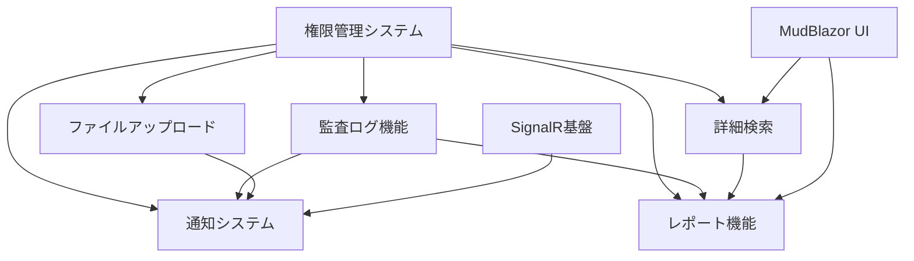

# 実装優先順位と依存関係レビュー

## 概要
6つの新機能の実装計画を作成しました。各機能の依存関係を分析し、最適な実装順序と統合戦略を提案します。

## 機能一覧と見積もり

### 優先度：高
1. **監査ログ機能** - 4-6日
2. **ファイルアップロード機能** - 6-8日
3. **詳細検索・フィルタリング機能** - 7-9日

### 優先度：中
4. **通知システム** - 6-8日
5. **レポート機能** - 8-10日
6. **権限管理システム** - 8-10日

**総開発工数**: 39-51日

## 依存関係分析

### 🔗 相互依存関係マップ



### 📊 依存関係詳細

#### 1. **権限管理システム** (基盤)
- **影響対象**: 全機能
- **理由**: セキュリティと機能アクセス制御の基盤
- **依存先**: なし（独立実装可能）

#### 2. **監査ログ機能** (横断的機能)
- **依存元**: 権限管理システム（操作権限チェック）
- **影響対象**: 通知システム、レポート機能
- **理由**: 他機能の操作履歴記録

#### 3. **通知システム** (サポート機能)
- **依存元**: SignalR基盤（既存）、監査ログ、権限管理
- **影響対象**: ファイルアップロード、詳細検索、レポート
- **理由**: 各機能の操作完了・エラー通知

#### 4. **ファイルアップロード機能** (独立機能)
- **依存元**: 権限管理（アップロード権限）、通知システム（完了通知）
- **影響対象**: レポート機能（ファイル出力）
- **理由**: 比較的独立した機能

#### 5. **詳細検索・フィルタリング機能** (データ機能)
- **依存元**: 権限管理（検索権限・データフィルタ）
- **影響対象**: レポート機能（検索結果レポート）
- **理由**: データアクセスの基盤機能

#### 6. **レポート機能** (統合機能)
- **依存元**: 権限管理、監査ログ、詳細検索、ファイルアップロード
- **影響対象**: なし（最終的なアウトプット機能）
- **理由**: 他機能のデータを統合・可視化

## 🎯 推奨実装順序

### Phase 1: 基盤システム構築 (8-10日)
```
1. 権限管理システム
   ├── 基本認証・認可機能
   ├── ロール・権限モデル
   ├── UI権限制御
   └── 初期ロール設定
```

**選定理由:**
- 他の全機能のセキュリティ基盤
- 早期実装で以降の開発でセキュリティ考慮が可能
- 独立して実装・テスト可能

### Phase 2: 監査・通知基盤 (10-14日)
```
2. 監査ログ機能
   ├── ログモデル・サービス
   ├── 自動ログ記録
   ├── ログ一覧・検索UI
   └── 権限統合

3. 通知システム
   ├── SignalR通知基盤
   ├── 通知UI コンポーネント
   ├── システム通知機能
   └── 監査ログ統合
```

**選定理由:**
- 横断的機能として他機能に影響
- 権限管理システムが完了しているため安全に実装可能
- 相互に補完し合う機能

### Phase 3: データ機能拡張 (13-17日)
```
4. ファイルアップロード機能
   ├── アップロード基盤
   ├── プロフィール画像機能
   ├── CSV インポート/エクスポート
   └── 通知・権限・監査統合

5. 詳細検索・フィルタリング機能
   ├── 高度検索システム
   ├── エクスポート機能拡張
   ├── 検索条件保存
   └── 権限による データフィルタ
```

**選定理由:**
- 実用的な機能向上
- 基盤システム（権限・監査・通知）が整備済み
- レポート機能の前提となるデータ処理機能

### Phase 4: 分析・レポート機能 (8-10日)
```
6. レポート機能
   ├── データ分析エンジン
   ├── チャート・可視化
   ├── PDF/Excel エクスポート
   └── 全機能統合（権限・監査・通知・検索）
```

**選定理由:**
- 他の全機能に依存する統合機能
- 最後に実装することで機能間の連携を最大化
- デモとしての完成度を高める最終機能

## 🚀 実装戦略

### 並行開発の可能性

#### Phase 1 完了後の並行開発
```
Phase 2A: 監査ログ機能 (4-6日)
Phase 2B: 通知システム (6-8日)  ← 部分的に並行可能
```

#### Phase 2 完了後の並行開発
```
Phase 3A: ファイルアップロード (6-8日)
Phase 3B: 詳細検索 (7-9日)      ← 完全に並行可能
```

**総工数最適化**: 39-51日 → **32-42日** (並行開発により7-9日短縮)

### 段階的リリース戦略

#### v1.1: セキュリティ強化版
- 権限管理システム
- 監査ログ機能
- **リリース目標**: Phase 1-2 完了後

#### v1.2: 機能拡張版
- 通知システム
- ファイルアップロード機能
- 詳細検索機能
- **リリース目標**: Phase 3 完了後

#### v1.3: 分析強化版
- レポート機能
- 全機能統合
- **リリース目標**: Phase 4 完了後

## ⚠️ リスク分析と対策

### 高リスク項目

1. **権限管理システムの複雑化**
   - **リスク**: セキュリティホール、保守性低下
   - **対策**: シンプルな設計、包括的テスト、段階的実装

2. **SignalR スケーラビリティ**
   - **リスク**: 通知システムの負荷問題
   - **対策**: Redis Backplane 準備、負荷テスト実施

3. **機能間統合の複雑さ**
   - **リスク**: 予期しない相互影響、バグの連鎖
   - **対策**: インターフェース設計重視、結合テスト強化

### 中リスク項目

1. **大容量ファイル処理**
   - **対策**: ストリーミング処理、プログレス表示
   
2. **レポート生成パフォーマンス**
   - **対策**: 非同期処理、キャッシュ戦略

3. **UI/UX の一貫性**
   - **対策**: デザインシステム活用、レビュー強化

## 📈 成功指標

### 技術指標
- **テストカバレッジ**: > 80%
- **パフォーマンス**: ページ読み込み < 3秒
- **セキュリティ**: 脆弱性検出 0件
- **安定性**: エラー率 < 0.1%

### ビジネス指標
- **ユーザビリティ**: タスク完了率 > 90%
- **機能利用率**: 新機能使用率 > 60%
- **顧客満足度**: デモ評価 > 4.0/5.0

## 🛠️ 開発リソース計画

### 推奨チーム構成
- **バックエンド開発者**: 1名（権限・監査・データ処理）
- **フロントエンド開発者**: 1名（UI/UX・コンポーネント）
- **フルスタック開発者**: 1名（統合・調整）

### 外部依存関係
- **Chart.js**: レポート機能チャート
- **EPPlus**: Excel エクスポート
- **iText7**: PDF 生成
- **SkiaSharp**: 画像処理

## 📋 品質管理計画

### コードレビュー
- **Phase完了時**: 包括的レビュー
- **機能統合時**: セキュリティフォーカスレビュー
- **リリース前**: 最終品質チェック

### テスト戦略
- **単体テスト**: 各Phase並行実施
- **統合テスト**: Phase完了後実施
- **セキュリティテスト**: 権限機能実装後実施
- **パフォーマンステスト**: 全機能統合後実施

## 🎉 期待される効果

### 短期効果（v1.1リリース後）
- セキュリティ強化による安全性向上
- 操作履歴による透明性確保
- 管理者の運用負荷軽減

### 中期効果（v1.2リリース後）
- ユーザビリティ大幅向上
- データ管理効率化
- 業務プロセス改善

### 長期効果（v1.3リリース後）
- データドリブンな意思決定支援
- 経営層向け分析レポート提供
- システムの完成度とデモ価値最大化

## 📝 まとめ

この実装計画により、段階的かつ安全に機能拡張を行い、最終的に高機能で安全な社員情報管理システムを構築できます。依存関係を考慮した実装順序により、各Phase での価値提供と最終的な統合効果の最大化を実現します。